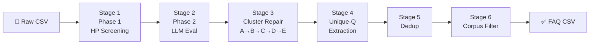

# kcc_faq — KCC FAQ Generation Pipeline

Self-contained end-to-end pipeline that turns raw **Kisan Call Centre (KCC)** query data
into a clean, ranked **FAQ CSV** of answer-distinct agricultural questions with their
real-world call frequencies.

```
Raw KCC CSV  →  Clustering  →  LLM Repair  →  Unique-Q Extraction  →  Filtered FAQ
```

---

## Table of Contents

1. [Setup](#setup)
2. [Running the Pipeline](#running-the-pipeline)
3. [Pipeline Stages in Detail](#pipeline-stages-in-detail)
4. [CLI Reference](#cli-reference)
5. [Resuming an Interrupted Run](#resuming-an-interrupted-run)
6. [Output Files](#output-files)
7. [Irrelevant Corpus Filter](#irrelevant-corpus-filter)
8. [Running Individual Scripts](#running-individual-scripts)
9. [Hardware Requirements](#hardware-requirements)

---

## Setup

```bash
# From the KCC Analysis/ root directory
python -m venv venv
source venv/bin/activate
pip install -r kcc_faq/requirements.txt

# Install PyTorch separately with your CUDA version, e.g.:
pip install torch --index-url https://download.pytorch.org/whl/cu121
```

---

## Running the Pipeline

### Option A — With Claude Haiku (recommended for Stage 4)

```bash
python kcc_faq/run_pipeline.py \
    --raw-file data/raw/punjab_maize_raw.csv \
    --crop "Maize Makka" \
    --api-key sk-ant-...
```

### Option B — Fully local (Qwen 7B for all LLM stages)

```bash
python kcc_faq/run_pipeline.py \
    --raw-file data/raw/punjab_maize_raw.csv \
    --crop "Maize Makka" \
    --model /path/to/qwen2.5-7b-instruct
```

> **Note:** `--raw-file` should contain a `Crop` column and a `QueryText` column
> (or `query_text`). The pipeline filters rows where `Crop` matches `--crop` exactly.

---

## Pipeline Stages in Detail



### Stage 1 — Phase 1: Hyperparameter Screening

**Script:** `pipeline/hyperparameter_tuning.py`

The pipeline runs a grid search over HDBSCAN + UMAP hyperparameter combinations to find
configurations that produce good clusters.

- Queries are embedded with `paraphrase-multilingual-mpnet-base-v2`
- A **hybrid distance matrix** is computed: `α × cosine(dense) + (1-α) × jaccard(TF-IDF)`
- Each config is scored on geometric metrics:
  - `50 < n_clusters < 1000`
  - `noise_ratio < 30 %`
  - `clusters_for_85pct > 5`
- Noise points are reassigned via KNN (nearest non-noise neighbour)
- Viable configs are saved as candidates for Stage 2

**Controls:** `--grid-mode`, `--max-queries`

**Outputs:** `phase1_candidates.csv`, `phase1_results.pkl`

---

### Stage 2 — Phase 2: LLM Evaluation

**Script:** `pipeline/llm_evaluator_hf.py`  
**Model:** Qwen2.5-7B-Instruct (local GPU)

The top-K candidates from Phase 1 are evaluated by the LLM on four axes per cluster sample:

| Score | Prompt asks | Good = |
|-------|-------------|--------|
| **Coherence** | Are all questions about the SAME topic? | A (same) |
| **Separation** | Should these two clusters stay separate? | A (different) |
| **Merge** | Should these near clusters merge? | A (merge) |
| **Outlier** | Which question doesn't belong? | `-1` (none) |

A **composite score** is computed and the winning hyperparameter config is selected.

**Controls:** `--phase2-top-k`, `--coverage-cap`

**Outputs:** `phase2_scores.csv`

---

### Stage 3 — Cluster Repair (Steps A–E)

**Script:** `pipeline/cluster_repair.py`  
**Model:** Qwen2.5-7B-Instruct (local GPU)

The best clustering is re-run and then cleaned up in five steps:

| Step | What it does |
|------|-------------|
| **A — Diverse Reps** | Selects `k=3` maximally diverse representative questions per cluster using greedy furthest-point selection |
| **B — Cross-Crop Filter** | LLM removes questions that are about a different crop than `--crop` |
| **C — Coherence + Split** | LLM rates each cluster A/B/C; clusters rated C are sent to a detailed split prompt to create sub-clusters |
| **D — Merge** | Clusters with cosine similarity ≥ `--merge-sim` are proposed as merge candidates; LLM confirms |
| **E — Back-Mapping** | Every original raw row is mapped to its final cluster; outputs the working files for Stage 4 |

**Controls:** `--diverse-k`, `--coherence-flag`, `--merge-sim`

**Outputs:** `repaired_clusters.csv`, `cluster_questions.csv`, `raw_row_mapping.csv`

---

### Stage 4 — Unique Question Extraction

**Script:** `pipeline/unique_question_finder.py`  
**Model:** Claude Haiku (Batch API) **or** Qwen2.5-7B (local)

Within each cluster, not all questions need a different answer. This stage groups questions
that would get the **same agricultural advice** into a single answer-distinct group.

- The representative question of each group = the one with the highest raw call frequency
- Cross-cluster deduplication is then run: groups from different clusters that are near-identical
  (embedding cosine ≥ `--dedup-thresh`, default 0.92) are merged and their frequencies summed

**LLM provider selection:**
- Pass `--api-key` → **Claude Haiku** via Anthropic Batch API *(faster, no GPU needed for this stage)*
- Omit `--api-key` → **Qwen 7B** via local HF *(slower, requires GPU)*

**Outputs:** `unique_questions.csv`, `unique_questions_freq.csv`, `unique_question_mapping.csv`

---

### Stage 5 — Final Deduplication

**Script:** `pipeline/dedup_freq_csv.py`

Case-insensitive deduplication of `representative_question` in the FAQ CSV.
When exact-string duplicates exist (after strip + lowercase), the one with the higher
`raw_frequency` is kept. Ranks are removed from the final output.

**Outputs:** `unique_questions_freq.csv` (overwritten in-place, cleaned)

---

### Stage 6 — Irrelevant Corpus Filter

**Script:** `pipeline/filter_faq_corpus.py`  
**Config:** `config/irrelevant_corpus.yaml`

Removes rows whose questions or cluster labels contain keywords from the irrelevant corpus.
Filtered categories include:

| Category | Examples removed |
|----------|-----------------|
| `contact_details` | "Contact no of KVK…", "Chief Agricultural Officer phone number" |
| `market_price` | "Mandi rate of maize", "MSP price details" |
| `weather` | "Weather forecast for Amritsar", "Rainfall today" |
| `subsidy_scheme` | "Subsidy on maize seeds", "Government scheme for machinery" |
| `incomplete_call` | "Wrong number", "Call disconnected" |
| `banking_admin` | "KCC loan details", "Bank manager contact" |

The filter checks **three columns**: `representative_question`, `cluster_label`, and `answer_label`.
Removed rows are saved to `corpus_filtered_out.csv` for auditing.

**Controls:** `--corpus-file`, `--skip-corpus-filter`

---

## CLI Reference

```
python kcc_faq/run_pipeline.py --help
```

### I/O (Required)

| Argument | Description |
|----------|-------------|
| `--raw-file PATH` | Path to raw KCC CSV (`Crop` + `QueryText` columns required) |
| `--crop NAME` | Crop name exactly as in the `Crop` column, e.g. `"Maize Makka"` |

### Model / API

| Argument | Default | Description |
|----------|---------|-------------|
| `--api-key KEY` | — | Anthropic API key; if omitted, local Qwen is used for Stage 4 |
| `--model PATH` | `qwen2.5-7b-instruct` | Local HF model path (Stages 2, 3, and 4 if no API key) |
| `--gpu-id N` | `0` | CUDA device index |
| `--batch-size N` | `8` | LLM inference batch size |

### Pipeline Control

| Argument | Default | Description |
|----------|---------|-------------|
| `--output-dir PATH` | `outputs/repair` | Base directory for all outputs |
| `--skip-phase1` | — | Skip Stage 1 — load existing `phase1_results.pkl` |
| `--skip-phase2` | — | Skip Stage 2 — use best config from `phase2_scores.csv` |
| `--skip-repair` | — | Skip Stage 3 — use existing `cluster_questions.csv` |
| `--skip-unique-q` | — | Skip Stage 4 — use existing `unique_questions_freq.csv` |
| `--skip-corpus-filter` | — | Skip Stage 6 |
| `--corpus-file PATH` | `kcc_faq/config/irrelevant_corpus.yaml` | Path to irrelevant keywords YAML |

### Tuning Parameters

| Argument | Default | Description |
|----------|---------|-------------|
| `--grid-mode` | `medium` | HP search grid: `quick` (18) / `medium` (108) / `full` (240) / `exhaustive` (480) |
| `--max-queries` | `20000` | Max unique queries to cluster (random sample if exceeded) |
| `--phase2-top-k` | `5` | Number of Phase 1 candidates to LLM-evaluate in Stage 2 |
| `--coverage-cap` | `0.80` | Fraction of query volume covered in Phase 2 evaluation |

### Repair Parameters

| Argument | Default | Description |
|----------|---------|-------------|
| `--diverse-k` | `3` | Number of diverse reps per cluster in Step A |
| `--coherence-flag` | `C` | LLM rating that triggers a split (`B` = aggressive, `C` = conservative) |
| `--merge-sim` | `0.82` | Cosine similarity threshold for merge candidates in Step D |

---

## Resuming an Interrupted Run

Each stage writes intermediate files. If a run fails, you can resume from any stage:

```bash
# Resume from Stage 2 (Phase 1 already done)
python kcc_faq/run_pipeline.py \
    --raw-file data/raw/punjab_maize_raw.csv \
    --crop "Maize Makka" \
    --skip-phase1

# Resume from Stage 4 (Stages 1–3 done)
python kcc_faq/run_pipeline.py \
    --raw-file data/raw/punjab_maize_raw.csv \
    --crop "Maize Makka" \
    --skip-phase1 --skip-phase2 --skip-repair \
    --api-key sk-ant-...

# Run only Stage 6 (filter on existing FAQ)
python kcc_faq/pipeline/filter_faq_corpus.py \
    --input  outputs/repair/maize_makka/unique_questions_freq.csv \
    --corpus kcc_faq/config/irrelevant_corpus.yaml
```

---

## Output Files

All outputs are written to `outputs/repair/<crop_slug>/`:

| File | Description |
|------|-------------|
| `phase1_candidates.csv` | All valid HP configs from grid search |
| `phase1_results.pkl` | Serialized clustering results (used for resuming) |
| `phase2_scores.csv` | LLM coherence/separation/merge scores per config |
| `repaired_clusters.csv` | Cluster summary after Steps A–E |
| `cluster_questions.csv` | Every question per repaired cluster |
| `raw_row_mapping.csv` | Every original raw row → final cluster ID |
| `unique_questions.csv` | All unique question groups with full metadata |
| ⭐ `unique_questions_freq.csv` | **Primary FAQ output** — ranked by call frequency |
| `unique_question_mapping.csv` | Every input question → unique group ID |
| `corpus_filtered_out.csv` | Rows removed by Stage 6 (for auditing) |

### FAQ Output Schema (`unique_questions_freq.csv`)

| Column | Description |
|--------|-------------|
| `unique_q_id` | Group identifier, format `<cluster_id>_<group_idx>` |
| `representative_question` | The question text shown in the FAQ |
| `raw_frequency` | Number of times this question (or equivalent) was asked |
| `pct_of_total` | Percentage of total calls for the crop |
| `cluster_id` | Source cluster ID |
| `cluster_label` | Short topic label for the cluster |
| `answer_label` | Short label for this answer group |
| `n_questions_in_group` | How many distinct phrasings were grouped together |
| `was_cluster_split` | Whether the cluster was split during repair |
| `parent_cluster` | Original cluster before split (if applicable) |
| `merged_from` | Source group IDs if this group was merged |
| `merged_cross_cluster` | `True` if the merge crossed cluster boundaries |

---

## Irrelevant Corpus Filter

The corpus filter config lives in `kcc_faq/config/irrelevant_corpus.yaml`.
To **add new irrelevant categories**, open the YAML and add a new block:

```yaml
categories:
  your_category:
    description: "What this category covers"
    keywords:
      - keyword one
      - multi word phrase
    typos:
      - comman typo
```

The filter will pick it up automatically on the next run — no code changes needed.

---

## Hardware Requirements

| Stage | CPU/GPU | Notes |
|-------|---------|-------|
| Stage 1 — Clustering | GPU recommended | Embedding ~20k queries takes ~2 min on GPU, ~15 min on CPU |
| Stage 2 — LLM Eval | **GPU required** | Loads Qwen2.5-7B (~16 GB VRAM in bfloat16) |
| Stage 3 — Repair | **GPU required** | Same Qwen model |
| Stage 4 — Unique-Q | GPU **or** API | Claude Haiku via `--api-key` requires no GPU |
| Stage 5 — Dedup | CPU only | Instant |
| Stage 6 — Filter | CPU only | ~1 sec for 1000 rows |
